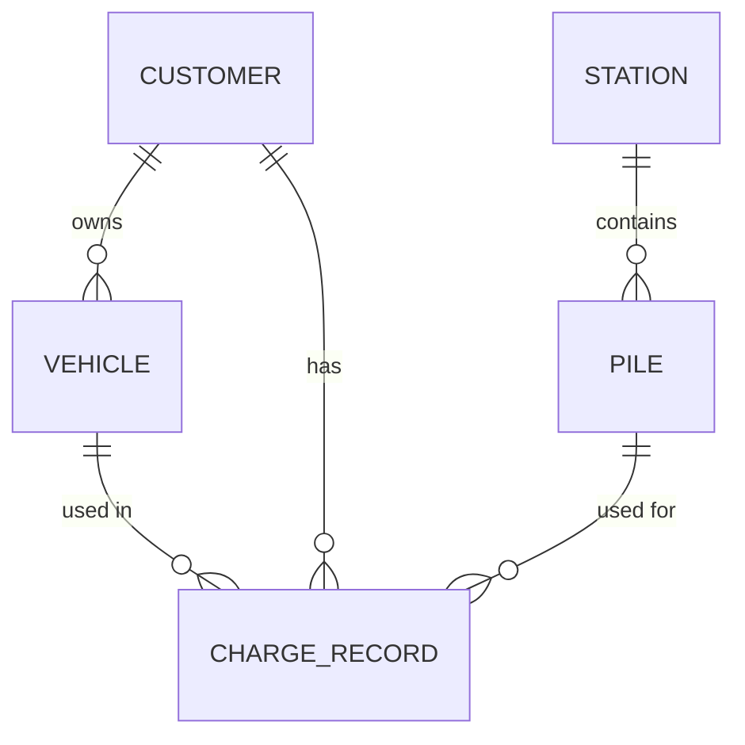

# 充电站运营管理系统需求文档

## 1. 系统概述
充电站运营管理系统是一套用于管理充电站日常运营的综合平台，包含充电桩管理、运营监控、客户管理等功能模块。

## 2. 功能模块

### 2.1 充电桩管理
- 充电桩CRUD操作
- 状态管理(空闲/充电中/离线/故障)
- 分类管理(汽车/电瓶车/公交车)
- 类型区分(直流/交流/混合)
- 图片管理(上传/预览/删除)

### 2.2 运营监控
- 地图可视化展示充电站分布
- 实时状态监控(正常/警告/故障)
- 统计卡片展示关键指标
- 搜索过滤功能
- 热力图展示

### 2.3 客户管理
- 客户CRUD操作
- 客户分类(个人/企业)
- 账户类型管理(预付费/后付费/月结算/年结算)
- 状态管理(正常/停用)
- 关联车辆管理
- 充电卡管理

### 2.4 页面功能

#### 充电桩管理页面(Piles.tsx)
- 充电桩列表：分页展示所有充电桩，支持按状态/类型/分类筛选
- 充电桩详情：展示充电桩完整信息和技术参数
- 新增/编辑表单：包含必填字段验证和图片上传功能
- 状态切换：支持手动设置充电桩状态
- 批量操作：支持批量启用/停用充电桩

#### 充电站管理页面(Stations.tsx)
- 充电站地图：展示充电站地理位置和状态标记
- 充电站列表：分页展示所有充电站基本信息
- 详情面板：展示充电站详情、服务信息和关联充电桩
- 运营数据：展示充电站运营指标图表
- 编辑功能：维护充电站基础信息和服务设置

#### 客户管理页面(CustomerManagement.tsx)
- 客户列表：分页展示客户信息，支持按类型/状态筛选
- 客户详情：展示客户完整信息和关联车辆
- 账户管理：支持修改账户类型和状态
- 车辆管理：维护客户关联的车辆信息
- 充电记录：查看客户历史充电记录

#### 充电记录页面(ChargeRecords.tsx)
- 记录查询：支持多条件组合查询充电记录
- 记录详情：展示充电过程详细数据和费用明细
- 异常标记：标记异常充电记录并添加备注
- 数据导出：支持导出查询结果为Excel文件
- 费用统计：按时间段统计充电收入和费用

#### 运营分析页面(OperationAnalysis.tsx)
- 实时监控：展示当前充电桩使用状态热力图
- 利用率分析：按日/周/月分析充电桩利用率
- 收入报表：生成充电收入统计报表
- 客户分析：分析客户充电行为和偏好
- 故障统计：统计充电桩故障类型和频率

#### 系统管理页面(SystemSettings.tsx)
- 用户管理：管理系统用户和权限
- 参数设置：配置系统运行参数
- 数据备份：执行数据库备份和恢复
- 日志查询：查看系统操作日志
- 系统监控：监控服务器运行状态

## 3. 数据库设计

### 3.1 表结构

#### 充电桩表(pile)
| 字段 | 类型 | 约束 | 说明 |
|------|------|------|------|
| id | bigint | PRIMARY KEY, AUTO_INCREMENT | 主键ID |
| code | varchar(32) | NOT NULL, UNIQUE | 充电桩编码 |
| name | varchar(64) | NOT NULL | 充电桩名称 |
| type | enum('DC','AC','HYBRID') | NOT NULL | 类型(直流/交流/混合) |
| category | enum('CAR','EBIKE','BUS') | NOT NULL | 分类(汽车/电瓶车/公交车) |
| status | enum('IDLE','CHARGING','OFFLINE','FAULT') | NOT NULL DEFAULT 'IDLE' | 状态 |
| station_id | bigint | FOREIGN KEY | 所属充电站ID |
| power | decimal(10,2) | NOT NULL | 额定功率(kW) |
| voltage | varchar(20) |  | 额定电压 |
| current | varchar(20) |  | 额定电流 |
| manufacturer | varchar(64) |  | 制造商 |
| production_date | date |  | 生产日期 |
| install_date | date |  | 安装日期 |
| longitude | decimal(10,6) |  | 经度 |
| latitude | decimal(10,6) |  | 纬度 |
| image_url | varchar(255) |  | 图片URL |
| created_at | datetime | NOT NULL DEFAULT CURRENT_TIMESTAMP | 创建时间 |
| updated_at | datetime | NOT NULL DEFAULT CURRENT_TIMESTAMP ON UPDATE CURRENT_TIMESTAMP | 更新时间 |

**索引**:
- 普通索引: station_id, status
- 唯一索引: code

#### 充电站表(station)
| 字段 | 类型 | 约束 | 说明 |
|------|------|------|------|
| id | bigint | PRIMARY KEY, AUTO_INCREMENT | 主键ID |
| name | varchar(64) | NOT NULL | 充电站名称 |
| address | varchar(255) | NOT NULL | 详细地址 |
| contact_phone | varchar(20) | NOT NULL | 联系电话 |
| total_piles | int | NOT NULL DEFAULT 0 | 充电桩总数 |
| available_piles | int | NOT NULL DEFAULT 0 | 可用充电桩数 |
| operator | varchar(64) |  | 运营商 |
| opening_hours | varchar(100) |  | 营业时间 |
| service_fee | decimal(10,2) |  | 服务费(元/度) |
| parking_fee | varchar(100) |  | 停车费说明 |
| facilities | varchar(255) |  | 配套设施 |
| longitude | decimal(10,6) | NOT NULL | 经度 |
| latitude | decimal(10,6) | NOT NULL | 纬度 |
| status | enum('NORMAL','MAINTENANCE','CLOSED') | NOT NULL DEFAULT 'NORMAL' | 状态 |
| created_at | datetime | NOT NULL DEFAULT CURRENT_TIMESTAMP | 创建时间 |
| updated_at | datetime | NOT NULL DEFAULT CURRENT_TIMESTAMP ON UPDATE CURRENT_TIMESTAMP | 更新时间 |

**索引**:
- 空间索引: longitude, latitude
- 普通索引: status

#### 客户表(customer)
| 字段 | 类型 | 约束 | 说明 |
|------|------|------|------|
| id | bigint | PRIMARY KEY, AUTO_INCREMENT | 主键ID |
| username | varchar(32) | NOT NULL, UNIQUE | 登录账号 |
| password | varchar(64) | NOT NULL | 密码(加密存储) |
| name | varchar(64) | NOT NULL | 客户名称 |
| type | enum('PERSONAL','COMPANY') | NOT NULL | 客户类型 |
| phone | varchar(20) | NOT NULL | 联系电话 |
| email | varchar(64) |  | 电子邮箱 |
| id_card | varchar(18) |  | 身份证号(个人) |
| company_name | varchar(64) |  | 公司名称(企业) |
| credit_level | tinyint | DEFAULT 3 | 信用等级(1-5) |
| account_type | enum('PREPAID','POSTPAID','MONTHLY','YEARLY') | NOT NULL | 账户类型 |
| balance | decimal(12,2) | DEFAULT 0.00 | 账户余额 |
| status | enum('ACTIVE','INACTIVE','FROZEN') | NOT NULL DEFAULT 'ACTIVE' | 状态 |
| created_at | datetime | NOT NULL DEFAULT CURRENT_TIMESTAMP | 创建时间 |
| updated_at | datetime | NOT NULL DEFAULT CURRENT_TIMESTAMP ON UPDATE CURRENT_TIMESTAMP | 更新时间 |

**索引**:
- 普通索引: phone, type, status
- 唯一索引: username

#### 车辆表(vehicle)
| 字段 | 类型 | 约束 | 说明 |
|------|------|------|------|
| id | bigint | PRIMARY KEY, AUTO_INCREMENT | 主键ID |
| customer_id | bigint | FOREIGN KEY | 所属客户ID |
| plate_no | varchar(12) | NOT NULL | 车牌号 |
| vehicle_type | varchar(20) |  | 车辆类型 |
| brand | varchar(32) |  | 品牌 |
| model | varchar(32) |  | 型号 |
| battery_capacity | decimal(8,2) |  | 电池容量(kWh) |
| max_range | int |  | 最大续航(km) |
| created_at | datetime | NOT NULL DEFAULT CURRENT_TIMESTAMP | 创建时间 |

**索引**:
- 普通索引: customer_id
- 唯一索引: plate_no

#### 充电记录表(charge_record)
| 字段 | 类型 | 约束 | 说明 |
|------|------|------|------|
| id | bigint | PRIMARY KEY, AUTO_INCREMENT | 主键ID |
| order_no | varchar(32) | NOT NULL, UNIQUE | 订单编号 |
| pile_id | bigint | FOREIGN KEY | 充电桩ID |
| customer_id | bigint | FOREIGN KEY | 客户ID |
| vehicle_id | bigint | FOREIGN KEY | 车辆ID |
| start_time | datetime | NOT NULL | 开始时间 |
| end_time | datetime |  | 结束时间 |
| start_soc | tinyint |  | 起始电量(%) |
| end_soc | tinyint |  | 结束电量(%) |
| energy_consumed | decimal(8,2) |  | 充电量(kWh) |
| duration | int |  | 充电时长(分钟) |
| fee | decimal(10,2) |  | 充电费用 |
| service_fee | decimal(10,2) |  | 服务费用 |
| total_fee | decimal(10,2) |  | 总费用 |
| payment_status | enum('UNPAID','PAID','REFUNDED') | NOT NULL DEFAULT 'UNPAID' | 支付状态 |
| created_at | datetime | NOT NULL DEFAULT CURRENT_TIMESTAMP | 创建时间 |

**索引**:
- 普通索引: pile_id, customer_id, payment_status
- 复合索引: (customer_id, start_time)

### 3.2 表关系图

## 4. 非功能性需求
- 响应时间: 列表加载<2s
- 并发支持: 100+用户同时操作
- 数据安全: 敏感信息加密存储
- 可用性: 99.9%正常运行时间

## 5. 后续建议
1. 补充财务模块详细需求
2. 完善报表分析功能
3. 增加API接口规范
4. 细化权限管理需求